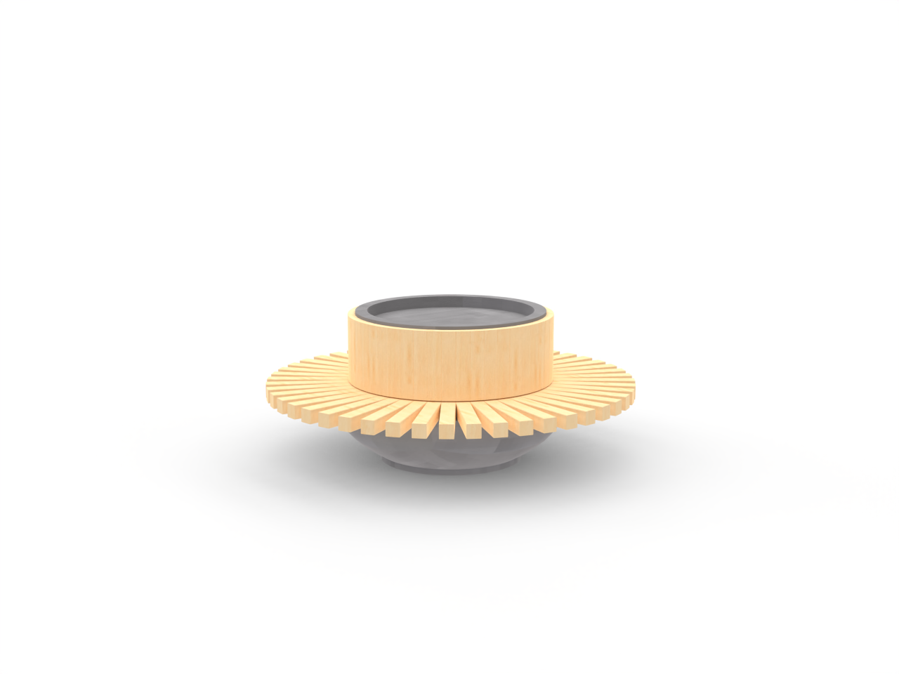

# Planters

Files and assets in the `Planters` folder.

## Files included

- [planter with seating 1.png](planter with seating 1.png)
- [planter with seating 2.png](planter with seating 2.png)
- [scale concrete rectangular planter.png](scale concrete rectangular planter.png)
- [scale concrete rectangular planter.stl](scale concrete rectangular planter.stl)
- [scale concrete rectangular planter.stp](scale concrete rectangular planter.stp)
- [scale concrete square planter.png](scale concrete square planter.png)
- [scale concrete square planter.stl](scale concrete square planter.stl)
- [scale concrete square planter.stp](scale concrete square planter.stp)
- [scale planter for ludlow.stl](scale planter for ludlow.stl)
- [scale planter with seating 1.stl](scale planter with seating 1.stl)
- [scale planter with seating 1.stp](scale planter with seating 1.stp)
- [scale planter with seating 2.stl](scale planter with seating 2.stl)
- [scale planter with seating 2.stp](scale planter with seating 2.stp)
- [scale-concrete-square-planter(1).stl](scale-concrete-square-planter(1).stl).stl)
- [scale-concrete-square-planter.stl](scale-concrete-square-planter.stl)

---

Notes

- For detailed asset documentation, see `docs/ASSET_DOCS_README.md` or `docs/README.md`.
