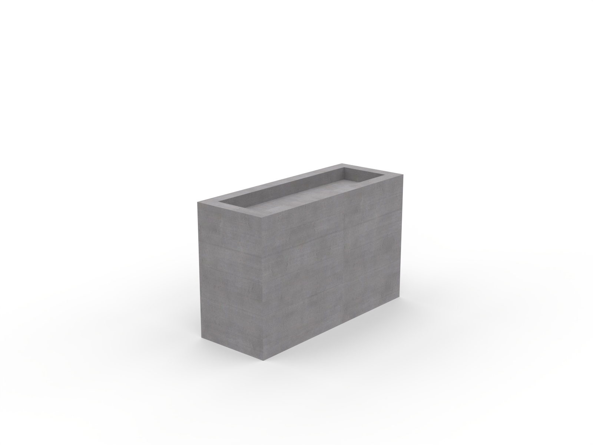

# Planters

## Files included

- `scale concrete rectangular planter.png`
- `scale concrete rectangular planter.stl`
- `scale concrete rectangular planter.stp`
- `scale concrete square planter.png`
- `scale concrete square planter.stl`
- `scale concrete square planter.stp`
- `scale planter with seating 1.stl`
- `scale planter with seating 1.stp`
- `scale planter with seating 2.stl`
- `scale planter with seating 2.stp`
- `planter with seating 1.png`
- `planter with seating 2.png`
