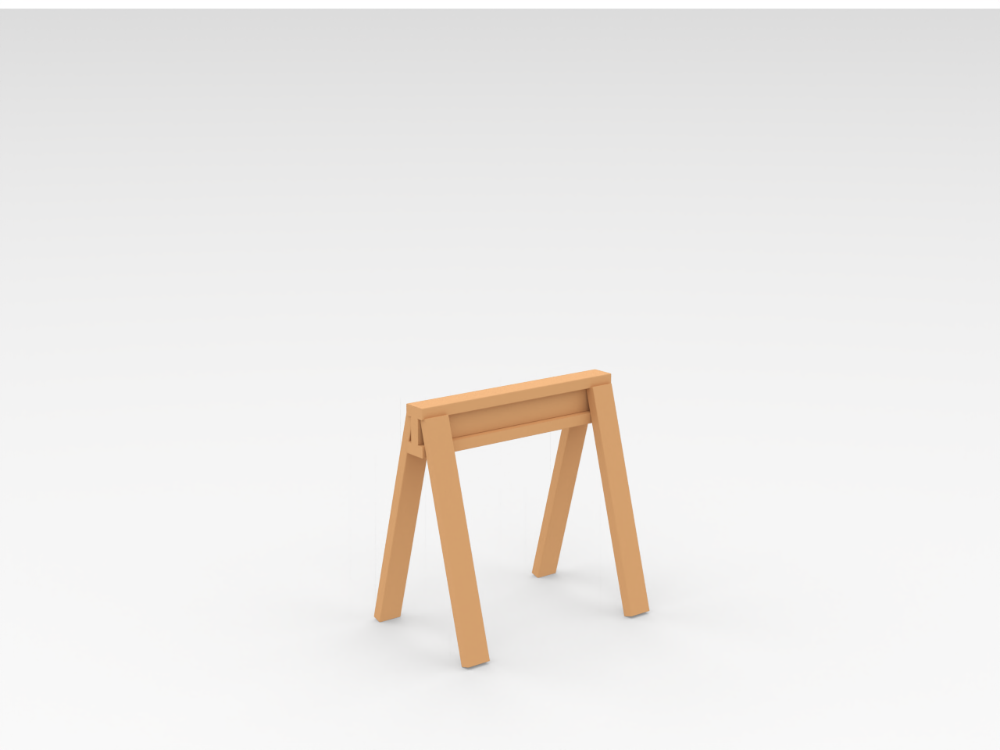

```markdown
# Saw Horse

Files and assets in the `Saw Horse` folder.



## Files included

- [scale saw horse.3mf](scale%20saw%20horse.3mf)
- [scale saw horse.png](scale%20saw%20horse.png)
- [scale saw horse.stl](scale%20saw%20horse.stl)
- [scale saw horse.stp](scale%20saw%20horse.stp)

---

Notes

- For detailed asset documentation, see `docs/ASSET_DOCS_README.md` or `docs/README.md`.

```
