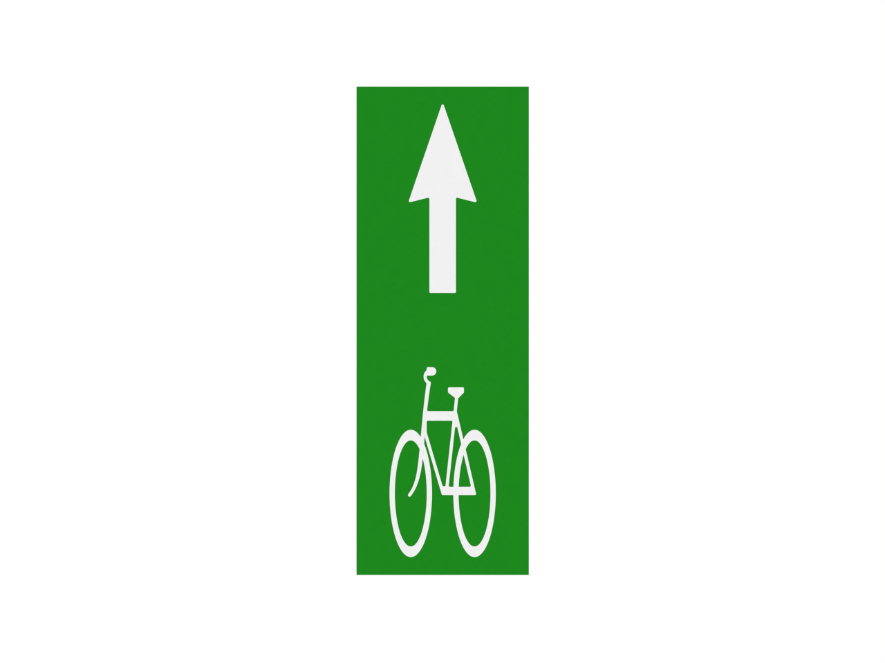

# Bike Lane

Files and assets in the `Bike Lane` folder.

## Files included

- [scale bike lane marking 1 text only.stl](scale bike lane marking 1 text only.stl)
- [scale bike lane marking 1 text only.stp](scale bike lane marking 1 text only.stp)
- [scale bike lane marking 1.dxf](scale bike lane marking 1.dxf)
- [scale bike lane marking 1.png](scale bike lane marking 1.png)
- [scale bike lane marking 1.stl](scale bike lane marking 1.stl)
- [scale bike lane marking 1.stp](scale bike lane marking 1.stp)
- [scale bike lane marking 2 decal only.stl](scale bike lane marking 2 decal only.stl)
- [scale bike lane marking 2 decal only.stp](scale bike lane marking 2 decal only.stp)
- [scale bike lane marking 2.dxf](scale bike lane marking 2.dxf)
- [scale bike lane marking 2.png](scale bike lane marking 2.png)
- [scale bike lane marking 2.stl](scale bike lane marking 2.stl)
- [scale bike lane marking 2.stp](scale bike lane marking 2.stp)
- [scale bike lane marking text only.stl](scale bike lane marking text only.stl)
- [scale bike lane marking text only.stp](scale bike lane marking text only.stp)
- [scale bike lane marking.dxf](scale bike lane marking.dxf)
- [scale bike lane marking.png](scale bike lane marking.png)
- [scale bike lane marking.stl](scale bike lane marking.stl)
- [scale bike lane marking.stp](scale bike lane marking.stp)

---

Notes

- For detailed asset documentation, see `docs/ASSET_DOCS_README.md` or `docs/README.md`.
