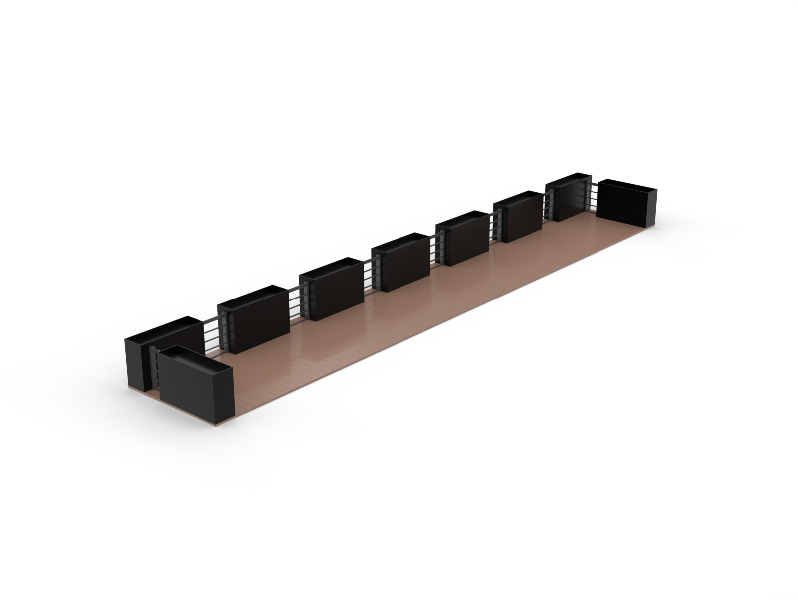

# Parklet

Files and assets in the `Parklet` folder.

## Files included

- [scale metal parklet.stl](scale metal parklet.stl)
- [scale metal parklet.stp](scale metal parklet.stp)
- [scale parklet metal 1.png](scale parklet metal 1.png)
- [scale parklet metal 2.png](scale parklet metal 2.png)
- [scale parklet metal 3.png](scale parklet metal 3.png)
- [scale parklet metal.png](scale parklet metal.png)
- [scale parklet with seating.png](scale parklet with seating.png)
- [scale parklet.png](scale parklet.png)
- [scale parklet.stl](scale parklet.stl)
- [scale parklet.stp](scale parklet.stp)
- [scale temporary parklet with tables.stl](scale temporary parklet with tables.stl)
- [scale-parklet.stl](scale-parklet.stl)
- [temporary parklet with tables 1.png](temporary parklet with tables 1.png)
- [temporary parklet with tables.png](temporary parklet with tables.png)

---

Notes

- For detailed asset documentation, see `docs/ASSET_DOCS_README.md` or `docs/README.md`.
