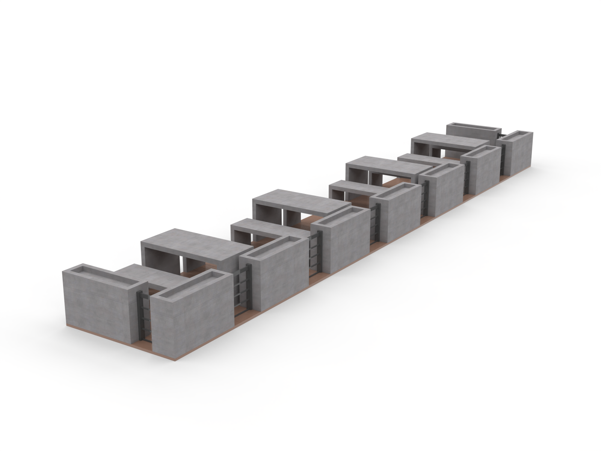
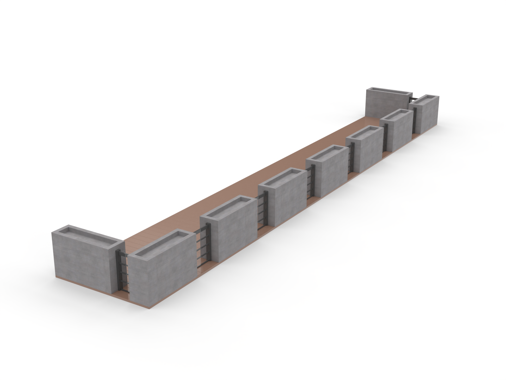

# Parklet
# Parklet

## Files included

- `scale parklet.stl`
- `scale parklet.stp`
- `scale parklet.png`
- `scale parklet with seating.png`
- `scale metal parklet.stl`
- `scale metal parklet.stp`
- `scale parklet metal 1.png`
- `scale parklet metal 2.png`
- `scale parklet metal 3.png`
- `scale temporary parklet with tables.stl`
- `temporary parklet with tables.png`
- `temporary parklet with tables 1.png`

Subfolders:

- `Temporary Parklet with Tables/`
- `Metal Parklet/`
- `Temporary Parklet with Tables/` — temporary parklet variants
