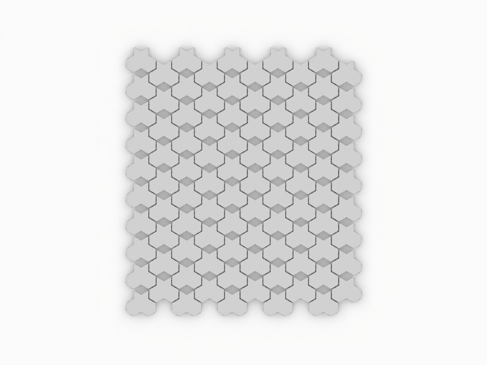

# Pavers

Files and assets in the `Pavers` folder.

## Files included

- [aqua trihex paver 1.png](aqua trihex paver 1.png)
- [aqua trihex paver 2.png](aqua trihex paver 2.png)
- [aqua trihex paver.png](aqua trihex paver.png)
- [aqua trihex paver.stp](aqua trihex paver.stp)
- [aqua trihex pavers.stp](aqua trihex pavers.stp)
- [scale trihex paver 1.png](scale trihex paver 1.png)
- [scale trihex paver 2.png](scale trihex paver 2.png)
- [scale trihex paver.png](scale trihex paver.png)
- [trihex paver.stp](trihex paver.stp)
- [trihex pavers.stp](trihex paver.stp)

---

Notes

- For detailed asset documentation, see `docs/ASSET_DOCS_README.md` or `docs/README.md`.
