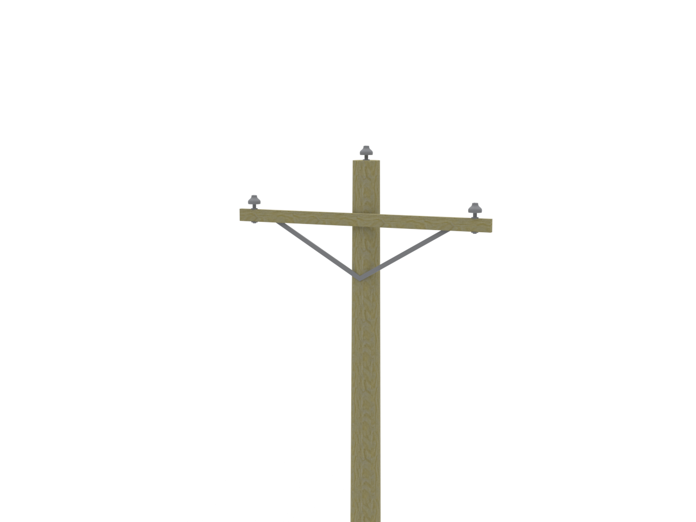

# Utility Pole

Files and assets in the `Utility Pole` folder.

## Files included

- [scale utility pole 1.png](scale utility pole 1.png)
- [scale utility pole only cross brace.stl](scale utility pole only cross brace.stl)
- [scale utility pole only cross brace.stp](scale utility pole only cross brace.stp)
- [scale utility pole only pole.stl](scale utility pole only pole.stl)
- [scale utility pole only pole.stp](scale utility pole only pole.stp)
- [scale utility pole part 1.stl](scale utility pole part 1.stl)
- [scale utility pole part.stl](scale utility pole part.stl)
- [scale utility pole.png](scale utility pole.png)
- [scale utility pole.stl](scale utility pole.stl)
- [scale utility pole.stp](scale utility pole.stp)

---

Notes

- For detailed asset documentation, see `docs/ASSET_DOCS_README.md` or `docs/README.md`.
