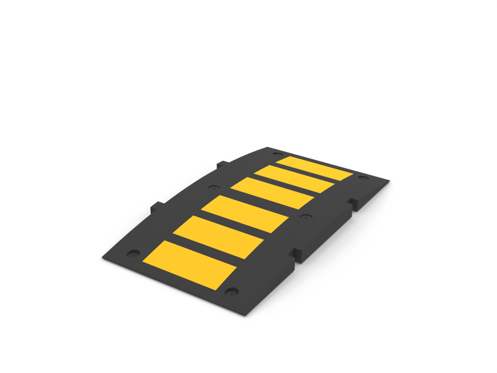

# Speed Humps

Files and assets in the `Speed Humps` folder.

## Files included

- [rubber speed hump 1.png](rubber speed hump 1.png)
- [rubber speed hump 2.png](rubber speed hump 2.png)
- [rubber speed hump 3.png](rubber speed hump 3.png)
- [rubber speed hump 4.png](rubber speed hump 4.png)
- [scale rubber speed hump 1.stl](scale rubber speed hump 1.stl)
- [scale rubber speed hump 2.stl](scale rubber speed hump 2.stl)
- [scale rubber speed hump 3.stl](scale rubber speed hump 3.stl)
- [scale rubber speed hump set.stl](scale rubber speed hump set.stl)
- [scale textured rubber speed hump 1.stl](scale textured rubber speed hump 1.stl)
- [scale textured rubber speed hump 2.stl](scale textured rubber speed hump 2.stl)
- [scale textured rubber speed hump 3.stl](scale textured rubber speed hump 3.stl)
- [scale textured rubber speed hump set.stl](scale textured rubber speed hump set.stl)
- [textured rubber speed hump 1.png](textured rubber speed hump 1.png)
- [textured rubber speed hump 2.png](textured rubber speed hump 2.png)
- [textured rubber speed hump 3.png](textured rubber speed hump 3.png)
- [textured rubber speed hump 4.png](textured rubber speed hump 4.png)

---

Notes

- For detailed asset documentation, see `docs/ASSET_DOCS_README.md` or `docs/README.md`.
